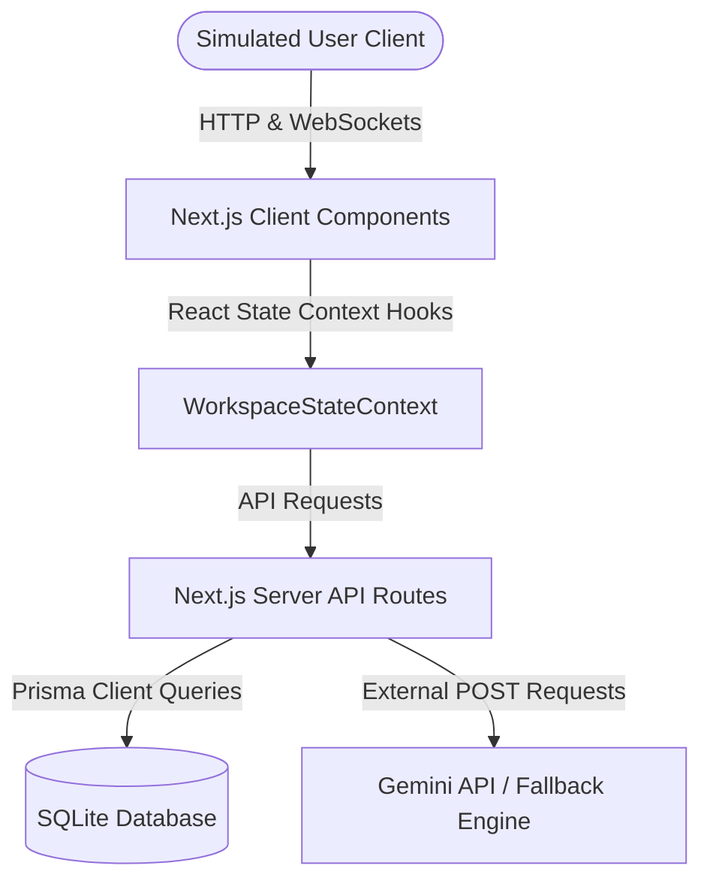

# System Architecture Note - Loan Data Verification Copilot

This document outlines the design decisions, schema configuration, API structures, validation algorithms, AI patterns, and trade-offs selected during the development of the Loan Data Verification Copilot.

---

## 1. System Design

The application follows a modular, three-tier architecture leveraging Next.js App Router (Full Stack Client-Server model):

- **Client Layer**: Uses Next.js client components optimized with Tailwind CSS and Radix UI dropdown primitives for a responsive, interactive dark UI. State synchronization is managed globally by the `WorkspaceContext` so drawers and modals can be triggered globally.
- **Server API Layer**: Next.js route handlers handle database logic, ingestion parsing (using `papaparse`), and AI analysis.
- **Database Layer**: SQLite managed via Prisma ORM for quick query execution, relational consistency, and atomic migrations.

---

## 2. Data Model

The database schema is structured around transactional traceability and records auditing:

- **`User`**: Tracks actors simulated in the workspace (`OPERATOR`, `REVIEWER`, `CONSUMER`).
- **`Upload`**: Preserves ingestion history records, row counts, filename parameters, and ingestion types (`LOAN_TAPE`, `SERVICER_UPDATE`, `DOCUMENT_MANIFEST`).
- **`LoanRecord`**: Houses normalized loan-level details. Linked to a parent `Upload` to trace raw source documents.
- **`Exception`**: Chronicles data conflicts or parsing failures generated by the validation engine. Each exception is linked to a single `LoanRecord` with fields representing the target property and severity.
- **`AuditLog`**: Relational, immutable log records documenting every mutation (field edits, status finalizations, uploads, exports).
- **`AIRecommendation`**: Stores Gemini suggestions, prompts, timestamps, and parameters to ensure full transparency of AI assistance.

---

## 3. Configurable Validation Engine

The engine (implemented in `lib/validation.ts`) performs 16 validation tests during CSV ingestion:

- **Missing Values**: Highlights missing keys or blank fields.
- **Record Integrity**: Prevents key collisions (`DUPLICATE_RECORD`) and identifies suspicious borrower-level duplicates.
- **Property Math**: Ensures balances are non-negative, interest rates are bounded (2.0% - 15.0%), and current outstanding balances never exceed origination principal values.
- **Logical Rules**: Evaluates maturity-to-origination date ordering, verifies payment statuses, and checks if status and Days Past Due (DPD) attributes are mathematically consistent.
- **Cross-Source Ingestion Checks**: Matches loan IDs against the loaded document manifests to identify missing files (`MISSING_DOCUMENTATION`) and compares interest rates/balances against servicing tapes to isolate servicing conflicts (`SOURCE_CONFLICT`).

---

## 4. AI Copilot Integration

The AI copilot provides automated review assistance across three interfaces:
1. **Explainers & Correction Suggester**: Summarizes rule exceptions and compiles a JSON recommendation containing corrected fields. Reviewers can apply these corrections with one click, loading them into the editor for manual inspection.
2. **AI Batch Summarizer**: Prompts Gemini with JSON lists of active exceptions across checked rows to output audit reports.
3. **Natural Language Rules Engine**: Translates natural language policies into structured validation rules configurations and TypeScript unit tests instantly.

*Note: If the Gemini API key is missing, the application automatically uses a rule-based fallback generator, ensuring all AI screens remain demoable out-of-the-box.*

---

## 5. Hashing & Cryptographic Traceability

Data integrity is secured using SHA-256 hashes generated during the approval phase.
- **Ordered Fields concatenation**: We concatenate stable, canonical attributes (`loanId`, `borrowerId`, `loanType`, `originationDate`, `maturityDate`, `originalPrincipal`, `currentBalance`, `interestRate`, `termMonths`, `borrowerState`, `paymentStatus`, `daysPastDue`, `servicerName`, `documentStatus`) joined by a fixed separator (`|`).
- **Audit Verification**: This hash is saved in the record. Because it excludes metadata, recalculating it dynamically on the consumer side always yields the identical string, proving the record has not been altered since approval.

---

## 6. Technical Trade-offs

1. **SQLite for Database Persistence**:
   - *Trade-off*: Selected SQLite over PostgreSQL/MySQL for simplicity and local runnability.
   - *Decision Rationale*: SQLite requires zero external service setup, fitting the hackathon's "local runnable setup" requirement perfectly while maintaining transactional integrity.
2. **Client-Side Simulation Roles**:
   - *Trade-off*: Simulates identity switches inside a client context (`RoleContext.tsx`) rather than requiring real oauth/password login.
   - *Decision Rationale*: Enables judges to switch between workspaces instantly via the top header selector to evaluate operator, reviewer, and consumer workflows in a single browser session.
3. **Next.js Route guards vs Middleware**:
   - *Trade-off*: Implemented route guard checks inside the layout file (`layout.tsx`) using `useEffect` rather than middleware.
   - *Decision Rationale*: Because the role is stored dynamically in client state / localStorage, middleware (which executes on the server side) cannot read client states on static paths. Performing client-side guard redirects ensures instant, correct route updates.
